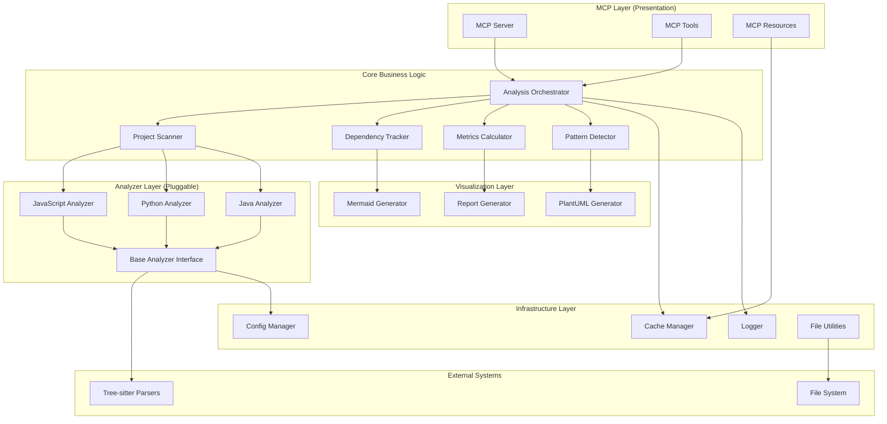
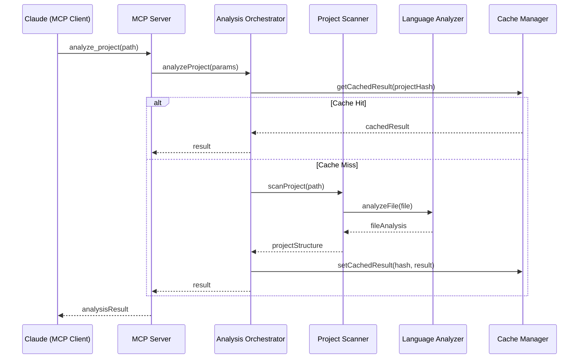
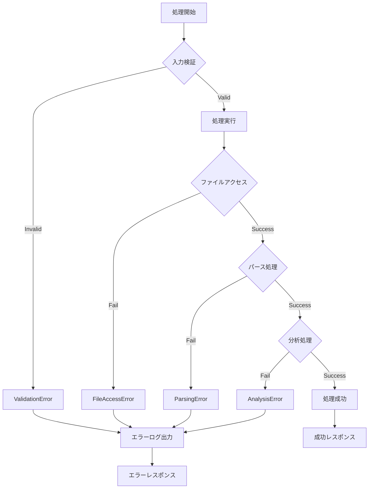

# プロジェクト分析MCPサーバー - アーキテクチャ設計書

## 1. システム全体概要

### 1.1 アーキテクチャパターン
- **レイヤードアーキテクチャ** + **プラガブルアーキテクチャ**
- **責任分離**: プレゼンテーション層（MCP）、ビジネスロジック層、データアクセス層
- **プラガブル設計**: 言語別アナライザーの動的追加

### 1.2 システム構成図



## 2. レイヤー詳細設計

### 2.1 MCP Layer (プレゼンテーション層)

#### 2.1.1 MCP Server
```typescript
interface IMCPServer {
  // サーバー起動・停止
  start(): Promise<void>;
  stop(): Promise<void>;
  
  // ツール・リソース登録
  registerTool(tool: IMCPTool): void;
  registerResource(resource: IMCPResource): void;
}

class MCPServer implements IMCPServer {
  private readonly tools = new Map<string, IMCPTool>();
  private readonly resources = new Map<string, IMCPResource>();
  private readonly orchestrator: AnalysisOrchestrator;
}
```

#### 2.1.2 MCP Tools
```typescript
interface IMCPTool {
  name: string;
  description: string;
  inputSchema: JSONSchema;
  execute(params: unknown): Promise<unknown>;
}

// 具体的なツール実装
class AnalyzeProjectTool implements IMCPTool {
  constructor(private readonly orchestrator: AnalysisOrchestrator) {}
  
  async execute(params: IAnalyzeProjectParams): Promise<IAnalysisResult> {
    return this.orchestrator.analyzeProject(params);
  }
}
```

### 2.2 Core Business Logic Layer

#### 2.2.1 Analysis Orchestrator (メインコーディネーター)
```typescript
interface IAnalysisOrchestrator {
  analyzeProject(params: IAnalyzeProjectParams): Promise<IAnalysisResult>;
  generateDiagram(params: IGenerateDiagramParams): Promise<string>;
  analyzeDependencies(params: IAnalyzeDependenciesParams): Promise<IDependencyResult>;
}

class AnalysisOrchestrator implements IAnalysisOrchestrator {
  constructor(
    private readonly scanner: IProjectScanner,
    private readonly tracker: IDependencyTracker,
    private readonly calculator: IMetricsCalculator,
    private readonly detector: IPatternDetector,
    private readonly cache: ICacheManager,
    private readonly logger: ILogger
  ) {}

  async analyzeProject(params: IAnalyzeProjectParams): Promise<IAnalysisResult> {
    // 1. プロジェクト構造スキャン
    const structure = await this.scanner.scanProject(params.projectPath);
    
    // 2. 技術スタック検出
    const techStack = await this.detector.detectTechStack(structure);
    
    // 3. 依存関係分析
    const dependencies = await this.tracker.analyzeDependencies(structure);
    
    // 4. メトリクス計算
    const metrics = await this.calculator.calculateMetrics(structure);
    
    // 5. アーキテクチャパターン検出
    const patterns = await this.detector.detectArchitecturePatterns(structure);
    
    return {
      structure,
      techStack,
      dependencies,
      metrics,
      patterns,
      generatedAt: new Date()
    };
  }
}
```

#### 2.2.2 Project Scanner
```typescript
interface IProjectScanner {
  scanProject(projectPath: string): Promise<IProjectStructure>;
}

class ProjectScanner implements IProjectScanner {
  constructor(
    private readonly analyzers: Map<string, ILanguageAnalyzer>,
    private readonly fileUtils: IFileUtils,
    private readonly config: IConfig
  ) {}

  async scanProject(projectPath: string): Promise<IProjectStructure> {
    // 1. ファイル一覧取得
    const files = await this.fileUtils.getAllFiles(projectPath);
    
    // 2. 言語別分類
    const filesByLanguage = this.classifyFilesByLanguage(files);
    
    // 3. 並列解析
    const analysisResults = await Promise.allSettled(
      Object.entries(filesByLanguage).map(([language, files]) =>
        this.analyzeLanguageFiles(language, files)
      )
    );
    
    return this.mergeAnalysisResults(analysisResults);
  }
}
```

### 2.3 Analyzer Layer (プラガブル層)

#### 2.3.1 Base Analyzer Interface
```typescript
interface ILanguageAnalyzer {
  readonly language: string;
  readonly supportedExtensions: string[];
  
  // ファイル解析
  analyzeFile(filePath: string): Promise<IFileAnalysis>;
  analyzeBatch(filePaths: string[]): Promise<IFileAnalysis[]>;
  
  // 依存関係抽出
  extractDependencies(filePath: string): Promise<IDependency[]>;
  
  // メトリクス計算
  calculateComplexity(filePath: string): Promise<IComplexityMetrics>;
}

abstract class BaseLanguageAnalyzer implements ILanguageAnalyzer {
  abstract readonly language: string;
  abstract readonly supportedExtensions: string[];
  
  protected readonly parser: IParser;
  protected readonly logger: ILogger;
  
  constructor(parser: IParser, logger: ILogger) {
    this.parser = parser;
    this.logger = logger;
  }
  
  // 共通処理のテンプレートメソッド
  async analyzeFile(filePath: string): Promise<IFileAnalysis> {
    try {
      const content = await fs.readFile(filePath, 'utf-8');
      const ast = await this.parser.parse(content);
      
      return {
        filePath,
        ast,
        dependencies: await this.extractDependencies(filePath),
        metrics: await this.calculateComplexity(filePath),
        analyzedAt: new Date()
      };
    } catch (error) {
      this.logger.error(`Failed to analyze file: ${filePath}`, error);
      throw new AnalysisError(`File analysis failed: ${filePath}`, 'FILE_ANALYSIS_ERROR', error);
    }
  }
}
```

#### 2.3.2 JavaScript/TypeScript Analyzer
```typescript
class JavaScriptAnalyzer extends BaseLanguageAnalyzer {
  readonly language = 'javascript';
  readonly supportedExtensions = ['.js', '.jsx', '.ts', '.tsx', '.mjs'];
  
  constructor() {
    super(
      new TreeSitterParser('javascript'),
      new Logger('JavaScriptAnalyzer')
    );
  }
  
  async extractDependencies(filePath: string): Promise<IDependency[]> {
    const ast = await this.parser.parseFile(filePath);
    const dependencies: IDependency[] = [];
    
    // import文の抽出
    this.traverseAST(ast, (node) => {
      if (node.type === 'import_statement') {
        dependencies.push({
          type: 'import',
          source: this.extractImportSource(node),
          specifiers: this.extractImportSpecifiers(node),
          isExternal: this.isExternalDependency(node)
        });
      }
    });
    
    return dependencies;
  }
  
  async calculateComplexity(filePath: string): Promise<IComplexityMetrics> {
    const content = await fs.readFile(filePath, 'utf-8');
    const analysis = escomplex.analyse(content);
    
    return {
      cyclomaticComplexity: analysis.aggregate.cyclomatic,
      cognitiveComplexity: analysis.aggregate.cognitive || 0,
      maintainabilityIndex: analysis.maintainability,
      linesOfCode: analysis.aggregate.sloc.logical,
      functions: analysis.functions.map(fn => ({
        name: fn.name,
        complexity: fn.cyclomatic,
        parameters: fn.params
      }))
    };
  }
}
```

### 2.4 Visualization Layer

#### 2.4.1 Diagram Generator Interface
```typescript
interface IDiagramGenerator {
  readonly format: 'mermaid' | 'plantuml' | 'dot';
  
  generateComponentDiagram(structure: IProjectStructure): string;
  generateDependencyDiagram(dependencies: IDependencyGraph): string;
  generateArchitectureDiagram(patterns: IArchitecturePattern[]): string;
}

class MermaidGenerator implements IDiagramGenerator {
  readonly format = 'mermaid' as const;
  
  generateDependencyDiagram(dependencies: IDependencyGraph): string {
    const nodes = dependencies.nodes.map(node => 
      `  ${this.sanitizeId(node.id)}[${node.name}]`
    ).join('\n');
    
    const edges = dependencies.edges.map(edge =>
      `  ${this.sanitizeId(edge.from)} --> ${this.sanitizeId(edge.to)}`
    ).join('\n');
    
    return `graph TD\n${nodes}\n${edges}`;
  }
}
```

### 2.5 Infrastructure Layer

#### 2.5.1 Cache Manager
```typescript
interface ICacheManager {
  get<T>(key: string): Promise<T | null>;
  set<T>(key: string, value: T, ttl?: number): Promise<void>;
  invalidate(pattern: string): Promise<void>;
  clear(): Promise<void>;
}

class HybridCacheManager implements ICacheManager {
  constructor(
    private readonly memoryCache: IMemoryCache,
    private readonly fileCache: IFileCache
  ) {}
  
  async get<T>(key: string): Promise<T | null> {
    // メモリキャッシュを優先
    let value = await this.memoryCache.get<T>(key);
    if (value) return value;
    
    // ファイルキャッシュから復元
    value = await this.fileCache.get<T>(key);
    if (value) {
      await this.memoryCache.set(key, value); // メモリに昇格
    }
    
    return value;
  }
}
```

## 3. データフロー設計

### 3.1 分析処理フロー



### 3.2 エラーハンドリングフロー



## 4. パフォーマンス設計

### 4.1 並列処理戦略

#### 4.1.1 ファイルレベル並列処理
```typescript
class ParallelAnalyzer {
  constructor(private readonly concurrency: number = 4) {}
  
  async analyzeFiles(files: string[]): Promise<IFileAnalysis[]> {
    const limiter = pLimit(this.concurrency);
    
    return Promise.all(
      files.map(file => 
        limiter(() => this.analyzeFile(file))
      )
    );
  }
}
```

#### 4.1.2 Worker Threads活用
```typescript
class HeavyAnalysisWorker {
  private workers: Worker[] = [];
  
  async analyzeWithWorkers(files: string[]): Promise<IAnalysisResult[]> {
    const chunks = this.chunkArray(files, this.workers.length);
    
    return Promise.all(
      chunks.map((chunk, index) => 
        this.runWorkerAnalysis(this.workers[index], chunk)
      )
    ).then(results => results.flat());
  }
}
```

### 4.2 メモリ最適化

#### 4.2.1 ストリーミング処理
```typescript
class StreamingAnalyzer {
  async analyzeFilesStream(projectPath: string): Promise<AsyncIterable<IFileAnalysis>> {
    const fileStream = this.createFileStream(projectPath);
    
    return async function* () {
      for await (const filePath of fileStream) {
        yield await this.analyzeFile(filePath);
      }
    }.call(this);
  }
}
```

#### 4.2.2 適応的キャッシュ
```typescript
class AdaptiveCacheManager {
  private memoryPressureThreshold = 0.8;
  
  async adaptToMemoryPressure(): Promise<void> {
    const usage = process.memoryUsage();
    const pressure = usage.heapUsed / usage.heapTotal;
    
    if (pressure > this.memoryPressureThreshold) {
      await this.evictLeastRecentlyUsed();
      await this.compressOldEntries();
    }
  }
}
```

## 5. 拡張性設計

### 5.1 プラグインシステム

#### 5.1.1 Analyzer Registry
```typescript
class AnalyzerRegistry {
  private analyzers = new Map<string, ILanguageAnalyzer>();
  
  register(analyzer: ILanguageAnalyzer): void {
    this.analyzers.set(analyzer.language, analyzer);
  }
  
  getAnalyzer(language: string): ILanguageAnalyzer | null {
    return this.analyzers.get(language) || null;
  }
  
  getByFileExtension(extension: string): ILanguageAnalyzer | null {
    for (const analyzer of this.analyzers.values()) {
      if (analyzer.supportedExtensions.includes(extension)) {
        return analyzer;
      }
    }
    return null;
  }
}
```

#### 5.1.2 Dynamic Loading
```typescript
class DynamicAnalyzerLoader {
  async loadAnalyzer(analyzerPath: string): Promise<ILanguageAnalyzer> {
    const module = await import(analyzerPath);
    const AnalyzerClass = module.default || module.Analyzer;
    
    if (!this.validateAnalyzer(AnalyzerClass)) {
      throw new Error('Invalid analyzer implementation');
    }
    
    return new AnalyzerClass();
  }
}
```

### 5.2 設定拡張

#### 5.2.1 階層化設定
```typescript
interface IAnalysisConfig {
  global: IGlobalConfig;
  languages: Record<string, ILanguageConfig>;
  patterns: IPatternConfig;
  visualization: IVisualizationConfig;
}

class ConfigManager {
  loadConfig(projectPath: string): IAnalysisConfig {
    const configs = [
      this.loadDefaultConfig(),
      this.loadUserConfig(),
      this.loadProjectConfig(projectPath)
    ];
    
    return this.mergeConfigs(configs);
  }
}
```

## 6. セキュリティ設計

### 6.1 入力検証・サニタイゼーション

#### 6.1.1 Path Traversal Protection
```typescript
class SecureFileAccess {
  private allowedBasePaths: string[];
  
  validatePath(inputPath: string): Result<string, SecurityError> {
    const resolvedPath = path.resolve(inputPath);
    
    // パストラバーサル検証
    if (inputPath.includes('..')) {
      return { success: false, error: new SecurityError('Path traversal detected') };
    }
    
    // 許可されたベースパス内かチェック
    const isAllowed = this.allowedBasePaths.some(basePath => 
      resolvedPath.startsWith(basePath)
    );
    
    if (!isAllowed) {
      return { success: false, error: new SecurityError('Access denied') };
    }
    
    return { success: true, data: resolvedPath };
  }
}
```

### 6.2 リソース制限

#### 6.2.1 Analysis Limits
```typescript
class ResourceLimiter {
  private readonly limits = {
    maxFileSize: 10 * 1024 * 1024, // 10MB
    maxFileCount: 10000,
    maxAnalysisTime: 5 * 60 * 1000, // 5分
    maxMemoryUsage: 512 * 1024 * 1024 // 512MB
  };
  
  async enforceLimit<T>(
    operation: () => Promise<T>,
    type: keyof typeof this.limits
  ): Promise<T> {
    const timeout = setTimeout(() => {
      throw new ResourceLimitError(`${type} limit exceeded`);
    }, this.limits[type]);
    
    try {
      return await operation();
    } finally {
      clearTimeout(timeout);
    }
  }
}
```

## 7. 監視・オブザーバビリティ

### 7.1 メトリクス収集

#### 7.1.1 Performance Metrics
```typescript
class PerformanceCollector {
  private metrics = new Map<string, IMetric[]>();
  
  recordAnalysisTime(operation: string, duration: number): void {
    this.metrics.set(operation, [
      ...(this.metrics.get(operation) || []),
      { timestamp: Date.now(), value: duration, unit: 'ms' }
    ]);
  }
  
  getAverageTime(operation: string): number {
    const values = this.metrics.get(operation) || [];
    return values.reduce((sum, m) => sum + m.value, 0) / values.length;
  }
}
```

### 7.2 ヘルスチェック

#### 7.2.1 System Health Monitor
```typescript
class HealthMonitor {
  async checkSystemHealth(): Promise<IHealthStatus> {
    const checks = await Promise.allSettled([
      this.checkMemoryUsage(),
      this.checkFileSystemAccess(),
      this.checkParserAvailability(),
      this.checkCacheHealth()
    ]);
    
    return {
      status: checks.every(c => c.status === 'fulfilled') ? 'healthy' : 'degraded',
      checks: checks.map(this.formatHealthCheck),
      timestamp: new Date()
    };
  }
}
```

---

**最終更新**: 2024-12-20
**アーキテクト**: [開発中]
**次回レビュー**: 実装フェーズ開始前